# zGrid Infrastructure & Deployment Architecture

```mermaid
graph TB
    %% Azure DevOps - CI/CD Pipeline
    subgraph "Azure DevOps"
        A[Source Code Repository] --> B[Build Pipeline]
        B --> C[Test & Validation]
        C --> D[Push to ACR]

        style A fill:#0078d4,color:#fff
        style B fill:#0078d4,color:#fff
        style C fill:#0078d4,color:#fff
        style D fill:#0078d4,color:#fff
    end

    %% Azure Container Registry
    subgraph "Azure Container Registry (ACR)"
        E[zinfradevv1.azurecr.io]

        subgraph "Container Images"
            E1[zgrid-pii:latest]
            E2[zgrid-tox:latest]
            E3[zgrid-jail:latest]
            E4[zgrid-policy:latest]
            E5[zgrid-ban:latest]
            E6[zgrid-secrets:latest]
            E7[zgrid-format:latest]
            E8[zgrid-gibberish:latest]
            E9[zgrid-gateway:latest]
        end

        style E fill:#f25022,color:#fff
        style E1 fill:#7fba00,color:#fff
        style E2 fill:#7fba00,color:#fff
        style E3 fill:#7fba00,color:#fff
        style E4 fill:#7fba00,color:#fff
        style E5 fill:#7fba00,color:#fff
        style E6 fill:#7fba00,color:#fff
        style E7 fill:#7fba00,color:#fff
        style E8 fill:#7fba00,color:#fff
        style E9 fill:#7fba00,color:#fff
    end

    %% Azure Kubernetes Service
    subgraph "Azure Kubernetes Service (AKS)"
        F[Helm Chart v0.2.0]
        G[z-grid namespace]

        subgraph "Configuration"
            H[ConfigMaps]
            I[Secrets]
        end

        subgraph "Microservice Pods"
            J[PII Service<br/>📊 GLiNER Model<br/>2CPU/2Gi RAM<br/>Port:8000]
            K[Toxicity Service<br/>☠️ Detoxify Model<br/>1CPU/1Gi RAM<br/>Port:8001]
            L[Jailbreak Service<br/>🛡️ jailbreak-classifier<br/>1CPU/1Gi RAM<br/>Port:8002]
            M[Policy Service<br/>🔐 LlamaGuard-7B<br/>2CPU/4Gi RAM<br/>Port:8003]
            N[Ban Service<br/>🚫 Pattern Matching<br/>0.5CPU/512Mi RAM<br/>Port:8004]
            O[Secrets Service<br/>🔑 Regex Detection<br/>0.5CPU/512Mi RAM<br/>Port:8005]
            P[Format Service<br/>📝 Cucumber Rules<br/>0.5CPU/512Mi RAM<br/>Port:8006]
            Q[Gibberish Service<br/>🔤 Scikit-learn<br/>0.5CPU/512Mi RAM<br/>Port:8007]
            R[Gateway Service<br/>⚡ Circuit Breaker<br/>1CPU/1Gi RAM<br/>Port:8008]
        end

        style F fill:#0078d4,color:#fff
        style G fill:#0078d4,color:#fff
        style H fill:#7fba00,color:#fff
        style I fill:#7fba00,color:#fff
        style J fill:#ffb900,color:#000
        style K fill:#ffb900,color:#000
        style L fill:#ffb900,color:#000
        style M fill:#ffb900,color:#000
        style N fill:#ffb900,color:#000
        style O fill:#ffb900,color:#000
        style P fill:#ffb900,color:#000
        style Q fill:#ffb900,color:#000
        style R fill:#ff8c00,color:#fff
    end

    %% Networking Layer
    subgraph "Network Layer"
        S[NGINX Ingress Controller]
        T[Azure Load Balancer]
        U[SSL/TLS Termination]
        V[Application Gateway]

        style S fill:#5e9624,color:#fff
        style T fill:#5e9624,color:#fff
        style U fill:#5e9624,color:#fff
        style V fill:#5e9624,color:#fff
    end

    %% External Endpoints
    subgraph "External Endpoints"
        W[pii.20.242.183.197.nip.io]
        X[tox.20.242.183.197.nip.io]
        Y[jail.20.242.183.197.nip.io]
        Z[policy.20.242.183.197.nip.io]
        AA[ban.20.242.183.197.nip.io]
        BB[secrets.20.242.183.197.nip.io]
        CC[format.20.242.183.197.nip.io]
        DD[gibberish.20.242.183.197.nip.io]
        EE[gateway.20.242.183.197.nip.io]

        style W fill:#000000,color:#fff
        style X fill:#000000,color:#fff
        style Y fill:#000000,color:#fff
        style Z fill:#000000,color:#fff
        style AA fill:#000000,color:#fff
        style BB fill:#000000,color:#fff
        style CC fill:#000000,color:#fff
        style DD fill:#000000,color:#fff
        style EE fill:#000000,color:#fff
    end

    %% Monitoring & Health
    subgraph "Monitoring"
        FF[Health Checks<br/>/health endpoints]
        GG[Circuit Breaker<br/>Status Monitoring]
        HH[Resource Monitoring<br/>CPU/RAM Usage]
        II[Application Insights]

        style FF fill:#bc1880,color:#fff
        style GG fill:#bc1880,color:#fff
        style HH fill:#bc1880,color:#fff
        style II fill:#bc1880,color:#fff
    end

    %% Connections - Pipeline Flow
    D --> E
    E --> E1
    E --> E2
    E --> E3
    E --> E4
    E --> E5
    E --> E6
    E --> E7
    E --> E8
    E --> E9

    %% Connections - Deployment
    E1 --> F
    E2 --> F
    E3 --> F
    E4 --> F
    E5 --> F
    E6 --> F
    E7 --> F
    E8 --> F
    E9 --> F

    F --> H
    F --> I
    F --> G

    H --> J
    H --> K
    H --> L
    H --> M
    H --> N
    H --> O
    H --> P
    H --> Q
    H --> R

    I --> J
    I --> K
    I --> L
    I --> M
    I --> N
    I --> O
    I --> P
    I --> Q
    I --> R

    %% Connections - Service Communication
    R --> J
    R --> K
    R --> L
    R --> M
    R --> N
    R --> O
    R --> P
    R --> Q

    %% Connections - Network Exposure
    R --> S
    S --> T
    T --> U
    U --> V

    V --> W
    V --> X
    V --> Y
    V --> Z
    V --> AA
    V --> BB
    V --> CC
    V --> DD
    V --> EE

    %% Connections - Monitoring
    J --> FF
    K --> FF
    L --> FF
    M --> FF
    N --> FF
    O --> FF
    P --> FF
    Q --> FF
    R --> FF

    R --> GG
    G --> HH
    HH --> II

    %% Add annotations
    classDef azure fill:#0078d4,color:#fff,stroke:#fff,stroke-width:2px
    classDef container fill:#f25022,color:#fff,stroke:#fff,stroke-width:2px
    classDef k8s fill:#5e9624,color:#fff,stroke:#fff,stroke-width:2px
    classDef service fill:#ffb900,color:#000,stroke:#fff,stroke-width:2px
    classDef gateway fill:#ff8c00,color:#fff,stroke:#fff,stroke-width:2px
    classDef endpoint fill:#000000,color:#fff,stroke:#fff,stroke-width:2px
    classDef monitor fill:#bc1880,color:#fff,stroke:#fff,stroke-width:2px

    class A,B,C,D azure
    class E,E1,E2,E3,E4,E5,E6,E7,E8,E9 container
    class F,G,H,I,S,T,U,V k8s
    class J,K,L,M,N,O,P,Q service
    class R gateway
    class W,X,Y,Z,AA,BB,CC,DD,EE endpoint
    class FF,GG,HH,II monitor
```

## Key Features:

🔧 **Azure Native**: Built entirely on Azure infrastructure
🚀 **CI/CD Pipeline**: Automated build, test, and deployment
📦 **Containerized**: Docker images with Azure Container Registry
☸️ **Kubernetes**: AKS with Helm for orchestration
🛡️ **Secure**: SSL/TLS, API keys, network policies
📊 **Monitored**: Health checks, circuit breakers, resource monitoring
⚡ **High Performance**: Load balanced with circuit breaker pattern
🔍 **AI-Powered**: 8 specialized AI/ML models for content moderation